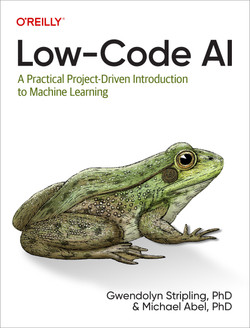

*This is not an official Google product*

# low-code-ai
This repository has been compiled as an easy-to-access resource for the code presented in the main text of the book. Note that for this reason, many comments and code explanations are found in the text of the book rather than the code here. 

If you find any errors or other issues with the code shared here, please create an Issue for this repository. For any errors or issues in the book, please submit errata at the [O'Reilly website](http://oreilly.com/catalog/0636920860877/errata?_gl=1*1beeaae*_ga*MTcwOTUxOTQ3OS4xNjc2NzUwNTU0*_ga_092EL089CH*MTY5NDk3MTk1MS41LjAuMTY5NDk3MTk1Ny41NC4wLjA.). Thank you!

### Title: Low-Code AI

## Table of Contents
0. Preface
   *  Who Should Read This Book?
   *  What Is and Isn’t in This Book
   *  Conventions Used in This Book
   *  Using Code Examples
   *  O’Reilly Online Learning
   *  How to Contact Us
   *  Acknowledgments

1. How Data Drives Decision Making in Machine Learning
 *  What Is the Goal or Use Case?
 *  An Enterprise ML Workflow
     *  Defining the Business Objective or Problem Statement
     *  Data Collection
     *  Data Preprocessing
     *  Data Analysis
     *  Data Transformation and Feature Selection
     *  Researching the Model Selection or Using AutoML (a No-Code Solution)
     *  Model Training, Evaluation, and Tuning
     *  Model Testing
     *  Model Deployment (Serving)
     *  Maintaining Models
 *  Summary

2. Data Is the First Step
 *  Overview of Use Cases and Datasets Used in the Book
     *  1. Retail: Product Pricing
     *  2. Healthcare: Heart Disease Campaign
     *  3. Energy: Utility Campaign
     *  4. Insurance: Advertising Media Channel Sales Prediction
     *  5. Financial: Fraud Detection
     *  6. Energy: Power Production Prediction
     *  7. Telecommunications: Customer Churn Prediction
     *  8. Automotive: Improve Custom Model Performance
 *  Data and File Types
     *  Quantitative and Qualitative Data
     *  Structured, Unstructured, and Semistructured Data
     *  Data File Types
     *  How Data Is Processed
 *  An Overview of GitHub and Google’s Colab
     *  Use GitHub to Create a Data Repository for Your Projects
     *  Using Google’s Colaboratory for Low-Code AI Projects
 *  Summary

3. Machine Learning Libraries and Frameworks
 *  No-Code AutoML
 *  How AutoML Works
 *  Machine Learning as a Service
 *  Low-Code ML Frameworks
     *  SQL ML Frameworks
     *  Open Source ML Libraries
 *  Summary

4. Use AutoML to Predict Advertising Media Channel Sales
 *  The Business Use Case: Media Channel Sales Prediction
     *  Project Workflow
     *  Project Dataset
 *  Exploring the Dataset Using Pandas, Matplotlib, and Seaborn
     *  Load Data into a Pandas DataFrame in a Google Colab Notebook
     *  Explore the Advertising Dataset
     *  Use AutoML to Train a Linear Regression Model
     *  No-Code Using Vertex AI
     *  Create a Managed Dataset in Vertex AI
     *  Select the Model Objective
     *  Build the Training Model
     *  Evaluate Model Performance
     *  Model Feature Importance (Attribution)
     *  Get Predictions from Your Model
 *  Summary

5. Using AutoML to Detect Fraudulent Transactions
 *  The Business Use Case: Fraud Detection for Financial Transactions
     *  Project Workflow
     *  Project Dataset
 *  Exploring the Dataset Using Pandas, Matplotlib, and Seaborn
   *  Loading Data into a Pandas DataFrame in a Google Colab Notebook
     *  Exploring the Dataset
     *  Exporting the Dataset
 *  Classification Models and Metrics
 *  Using AutoML to Train a Classification Model
     *  Creating a Managed Dataset and Selecting the Model Objective
     *  Exploring Dataset Statistics
     *  Training the Model
     *  Evaluating Model Performance
     *  Model Feature Importances
     *  Getting Predictions from Your Model
 *  Summary

6. Using BigQuery ML to Train a Linear Regression Model
 *  The Business Use Case: Power Plant Production
 *  Cleaning the Dataset Using SQL in BigQuery
     *  Loading a Dataset into BigQuery
     *  Exploring Data in BigQuery Using SQL
 *  Linear Regression Models
     *  Feature Selection and Correlation
     *  Google Colaboratory
     *  Plotting Feature Relationships to the Label
     *  The CREATE MODEL Statement in BigQuery ML
 *  Introducing Explainable AI
     *  Explainable AI in BigQuery ML
     *  Exercises
 *  Neural Networks in BigQuery ML
     *  Brief Overview of Neural Networks
     *  Activation Functions and Nonlinearity
     *  Training a Deep Neural Network in BigQuery ML
     *  Exercises
 *  Deep Dive: Using Cloud Shell to View Your Cloud Storage File
 *  Summary

7. Training Custom ML Models in Python
 *  The Business Use Case: Customer Churn Prediction
 *  Choosing Among No-Code, Low-Code, or Custom Code ML Solutions
 *  Exploring the Dataset Using Pandas, Matplotlib, and Seaborn
     *  Loading Data into a Pandas DataFrame in a Google Colab Notebook
     *  Understanding and Cleaning the Customer Churn Dataset
     *  Transforming Features Using Pandas and Scikit-Learn
 *  Building a Logistic Regression Model Using Scikit-Learn
     *  Logistic Regression
     *  Training and Evaluating a Model in Scikit-Learn
     *  Classification Evaluation Metrics
     *  Serving Predictions with a Trained Model in Scikit-Learn
     *  Pipelines in Scikit-Learn: An Introduction
 *  Building a Neural Network Using Keras
     *  Introduction to Keras
     *  Training a Neural Network Classifier Using Keras
     *  Building Custom ML Models on Vertex AI
 *  Summary

8. Improving Custom Model Performance
 *  The Business Use Case: Used Car Auction Prices
 *  Model Improvement in Scikit-Learn
     *  Loading the Notebook with the Preexisting Model
     *  Loading the Datasets and the Training-Validation-Test Data Split
     *  Exploring the Scikit-Learn Linear Regression Model
     *  Feature Engineering and Improving the Preprocessing Pipeline
     *  Hyperparameter Tuning
 *  Model Improvement in Keras
     *  Introduction to Preprocessing Layers in Keras
     *  Creating the Dataset and Preprocessing Layers for Your Model
     *  Building a Neural Network Model
     *  Hyperparameter Tuning in Keras
 *  Hyperparameter Tuning in BigQuery ML
     *  Loading and Transforming Car Auction Data
     *  Training a Linear Regression Model and Using the TRANSFORM Clause
     *  Configure a Hyperparameter Tuning Job in BigQuery ML
 *  Options for Hyperparameter Tuning Large Models
     *  Vertex AI Training and Tuning
     *  Automatic Model Tuning with Amazon SageMaker
     *  Azure Machine Learning
 *  Summary

9. Next Steps in Your AI Journey
 *  Going Deeper into Data Science
     *  Working with Unstructured Data
     *  Generative AI
     *  Explainable AI
 *  ML Operations
 *  Continuous Training and Evaluation
 *  Summary
